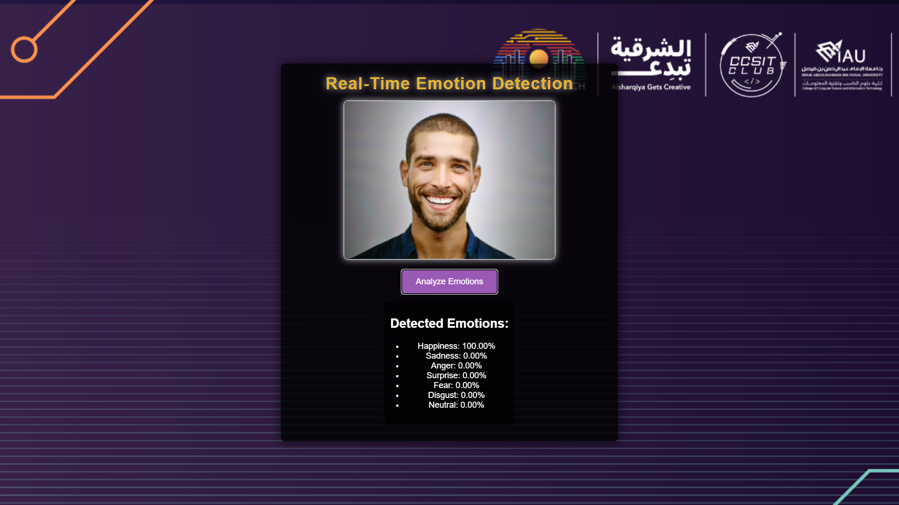
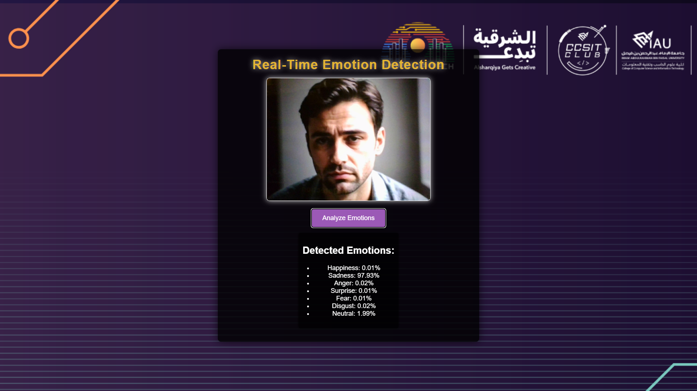

# FaceDetector

### Real-Time Facial Emotion Recognition using Computer Vision

A browser-based computer vision application that detects facial expressions from images and predicts the user's emotion in real time.

Developed for the **AI & Robot Club** at **Imam Abdulrahman Bin Faisal University** and showcased during **Dawn of Tech – Alsharqiya Gets Creative**, where visitors interacted with the application live.

---

## Demo

<p align="center">
  
  
</p>

<p align="center">
Examples of emotion recognition demonstrating different prediction results.
</p>

---

## Features

- Detects facial emotions using computer vision.
- Classifies emotions with confidence scores.
- Simple and responsive web interface.
- Runs entirely in the browser.
- No user images are uploaded or stored.

---

## Tech Stack

| Component | Technology |
|-----------|------------|
| Frontend | HTML5, CSS3 |
| Programming | JavaScript |
| AI Model | DeepFace |
| Image Processing | OpenCV |

---

## Running Locally

Open:

```
rabdullah97.github.io/FaceDetector/
```

---

## Supported Emotions

- Happy
- Sad
- Angry
- Fear
- Surprise
- Disgust
- Neutral

---

## Privacy

All processing is performed locally during execution. No user images are stored or shared by the application.

---

## Acknowledgements

Developed for the **AI & Robot Club** at **Imam Abdulrahman Bin Faisal University**.

Presented during **Dawn of Tech – Alsharqiya Gets Creative**.
